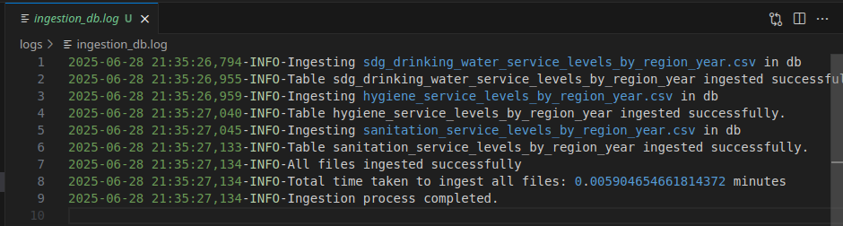

# Internship-1-IBM-SkillsBuild-CSRBOX
## Introduction : 
- This is my first internship @CSRBOX & IBM Skillsbuild of "Data Analyst", and in this repo ,i will share all my learnings and answering some important questions like
  1. "How to collect , clean, analyze and visualize data ?"
  2. "How to do Data Analytics project from start to end ?"
And some of the best RESOURCES that i gathered in this process of learning.
- In this internship, i deep dived into the world of "Data Analytics" , mentored by industry experts from IBM, performing following tasks :
1. Data Collection
2. Data Cleaning
3. Data Analysis
4. Data Visualization

## Tools and Technologies i used to make this project are as follows :
1. Python (libraries like pandas, numpy, matplotlib and seaborn, scikit-learn)
2. Jupyter notebook as workspace
3. Tableau for making interactive data visualizations
4. Notion for project management

# Datasets
1. sdg_drinking_water_service_levels_by_region_year.csv (Drinking water (Analysis by Service level) by SDG Regions, 23 years)
This dataset contains
- **Comprehensive Coverage:** This dataset provides annual data (2000–2022) on drinking water service levels across global SDG regions, segmented by region, residence type (urban/rural/total), and service type.

- **Service Level Classification:** It categorizes drinking water access into multiple service levels, including "Safely managed service," "At least basic," "Basic service," "Limited service," "Unimproved," and "Surface water."

- **Key Metrics:** For each entry, the dataset includes coverage percentage, affected population, and detailed breakdowns by year, enabling analysis of progress toward SDG 6 (Clean Water and Sanitation).

2. hygiene_service_levels_by_region_year.csv (Hygiene_by_Regions(2000-2022))
This dataset contains
- **Regional Hygiene Data:** Contains yearly data (2000–2022) on hygiene service levels across major world regions, supporting SDG monitoring.
- **Service Level Breakdown:** Reports population (in millions) with access to "Basic Hygiene," "Limited Hygiene," and "No handwashing facility" for each region and year.
- **Trend Analysis Ready:** Enables analysis of hygiene improvements and gaps over time, highlighting progress and persistent challenges in global hygiene access.

3. sanitation_service_levels_by_region_year.csv (Sanitation_by_Regions(2000-2022))
This dataset contains
- **Regional Sanitation Data:** Provides annual data (2000–2022) on sanitation service levels for major world regions, supporting SDG 6 analysis.
- **Detailed Service Categories:** Includes population (in millions) for "Basic Sanitation," "Limited Sanitation," "Open Defecation," "Safely Managed Sanitation," and "Unimproved Sanitation" by region and year.
- **Progress Tracking:** Enables assessment of improvements and persistent gaps in sanitation access, facilitating trend and policy impact analysis over time.

# What data analytics can we perform on these datasets that can help in SDG goal 6 insights
We can perform several data analytics tasks on these datasets to generate valuable insights for SDG Goal 6 (Clean Water and Sanitation):

- **Trend Analysis:**  
  Analyze changes in access to drinking water, sanitation, and hygiene services over time for each region. Identify regions with the fastest or slowest progress.

- **Regional Comparisons:**  
  Compare service levels (e.g., basic, safely managed, unimproved) across different regions to highlight disparities and identify areas needing urgent intervention.

- **Gap Identification:**  
  Quantify populations still lacking basic services (e.g., those with "No handwashing facility," "Open Defecation," or "Unimproved" water/sanitation) to prioritize policy actions.

- **Correlation Studies:**  
  Explore relationships between improvements in water, sanitation, and hygiene (WASH) services and other indicators (e.g., population growth, urban/rural split).

- **Impact Assessment:**  
  Evaluate the impact of interventions or policy changes by examining shifts in service levels before and after specific years or events.

- **Forecasting:**  
  Use time series analysis to predict future coverage rates and estimate when universal access might be achieved in different regions.

- **Visualization:**  
  Create maps, line charts, and bar plots to visually communicate progress, gaps, and trends to stakeholders and policymakers.

These analyses can help track progress, inform decision-making, and support advocacy for achieving SDG 6 targets.

`ingestion_db.py` - script to ingest raw CSVs data & logging
- Each "function" must has try except block to keep track of errors and problems it encounters, docstring, logging
